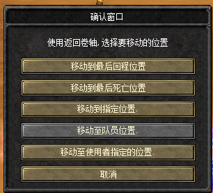

# isro 项目

## 概述(旧版)

1. csro 也称丝路传说R，是丝路传说的一个版本 ，这个版本是VSRO188的更新版本。
2. ISRO 是丝路传说的另一个版本，这个版本是在CSRO的基础上进行更新的版本，大约在2018年的游戏版本
3. csro和isro目前都没有源码文件.

## 项目概述（新）

我了解到一个csro和isro的软件， 注意，我并没有拿到远吗，所以这是一个问题， 我想没有远吗的基础上也能达到我的目的吧， 我知道很难， 不过， 既然人家做到我想我也可以做到。

故事是这样的， 我在[网站] https://www.vsro.org/ 了解了这个软件， 然后，我在[网址] https://www.vsro.org/ 下载了压缩包， 压缩包在 `D:\CSRO.zip` 中， 这是一切的出发点。 

我做了这些事情：
1. 下载了压缩包存储在：`D:\CSRO`中。
2. 解压了释放到`D:\CSRO` 路径中。
3. 我使用了codex (变成智能体，也就是你本人)， 进行过一些开发， 但是没有达到我的预期。所以路径`D:\CSRO`的文件可能已经不是原始文件。
4. 是否可以修改`路基补充`的文件， 答：可以。
5. 如果原始文件不适合继续， 那么是否可以给予压缩包还原： 答： 可以。

## 我本人对这个项目的了解

- 这个项目需要按顺序启动,启动顺序如下:
1. "D:\R-无授权管理器\CenterManagerServer.exe"  - 认证程序
2. "D:\CSRO\1-GlobalManager.exe"  - 全体管理器
3. "D:\CSRO\2-MachineManager.exe" - 模块管理器
4. "D:\CSRO\3-DownloadServer.exe" - 下载服务器
5. "D:\CSRO\4-gatewayserver.exe" -  网关服务器
6. "D:\CSRO\5-FarmManager.exe" -    分配管理器
7. "D:\CSRO\6-Agentserver.exe" -    代理服务器
8. "D:\CSRO\7-SR_ShardManager.exe" - 分片管理器
9. "D:\CSRO\8-SR_GameServer.exe" -  游戏服务器
10. "D:\CSRO\SMC\smc.exe" - SMC启动器   

## 文档和指引

- [csro] 
  - [官方网址1](https://silkroad.iccgame.com/home.html)
  - [开源软件参考1](https://www.vsro.org/forumlar/csro-paylasimlari.16/)

## 核心需要

我需要实现CSRO的软件在原有返回功能的基础上添加"移动到队友位置"和“移动至使用者指定位置” 这两个和兴功能。

## 其他参考：
1. 功能截图：
    - [图片1](D:\做ISRO返回记录\截图\7199af63-d3f0-4200-b992-f4f549e2140a.png)
    - [图片2](D:\做ISRO返回记录\截图\c14b8389-f9a0-4f9d-8faf-18cebb38cfc2.png) 

## 约定 

1. 相关文件， 操作在本机操作， 注意当前仓库并没有想过可执行程序远吗。 

## 约束和边界

### 允许

1. 按需启动（重启，关闭）相关程序。 

### 禁止

暂无

## 其他提示

1. 可能已经启动相关进场或者服务实例， 所以注意不要重复启动。能复用已有实力的尽力复用， 
2. 当配置更改或者其他更改后， 可能需要重启服务， 允许并鼓励这么做。
3. scripts - 这是游戏的脚本  log - 这是游戏的日志  此目录 D:\CSRO 的有log的都是关于报错或日志信息
4. 可能存在配置文件， 应当注意。
5. 查看有利于了解程序的证实运行情况。

## 任务执行提示

1. 如果任务来自于 github issues, 那么在对应的issues中以 comment 的方式给我回复。

## 最终验收标准

进游戏进行复现验证，验证如下：
1. 右键点击返回卷轴第二次，客户端不闪退
2. 右键点击返回卷轴出现的界面UI必须与ISRO界面UI一样：如图
3. 右键点击返回卷轴出现的

## 旧的提示（可能已经不再适用）
每次进行新任务必须阅读以下边界要求：
1、第一个附图 “移动到队友位置” 没有置灰 这是错的
2、第二个附图 “移动到队友位置” 这是正常状态
目的：要把服务端GS D:\CSRO\8-SR_GameServer.exe 和客户端EXE F:\CSRO客户端\SRO_Client.exe 也就是第一个附图中的 “移动到队友位置”的界面UI 修复为 第二个附图 “移动到队友位置” 界面UI的置灰状态
执行要求如下：
1、参考 D:\做ISRO返回记录 该目录中的所有记录，这个目录中记录的不一定是对的，所以需要再次验证。找到正确的方式
2、修复服务端GS或客户端EXE的 “移动到队友位置” 置灰 可参考服务端GS F:\SR_GameServer.exe 和客户端EXE F:\ISRO客户端国服\sro_client.exe 。 需要十分注意的事项：服务端GS D:\CSRO\8-SR_GameServer.exe 与服务端GS  F:\SR_GameServer.exe 、 客户端EXE F:\CSRO客户端\SRO_Client.exe 和客户端EXE F:\ISRO客户端国服\sro_client.exe 
之间版本不同，结构不同，所以在修复过程中不能直接照搬过来用。我不知道置灰状态是修复GS还是EXE 还是GS和EXE都要修复，所以需要你给出正确的执行方案。
2、每次修复之前，必须先备份修复的原EXE文件，修复失败马上还源备份的EXE文件
3、只有真正的打了 D:\CSRO\8-SR_GameServer.exe 或 F:\CSRO客户端\SRO_Client.exe 补丁后才能叫我上游戏进行复现
